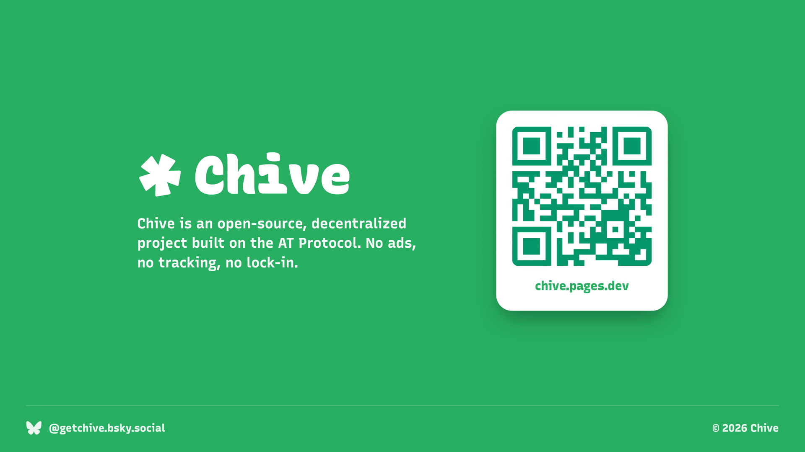

# Chive

Chive is an open-source recipe app built on the [AT Protocol](https://atproto.com/). Anyone can browse recipes; people with an ATProto account can publish from the web app, keep bookmarks, and retain their work in their own repository instead of a Chive-owned database.

**[Open Chive](https://chive.pages.dev)**



## What it does

- searches and filters recipes published under the `com.chive.recipe` collection;
- reads recipe details and images directly from authors' ATProto repositories;
- signs users in through ATProto OAuth without introducing a separate Chive account;
- publishes new recipe records and image blobs to the signed-in user's repository;
- stores cloud bookmarks as native `app.bsky.feed.like` records;
- provides author profiles and editorial recipe collections.

## Why ATProto

The central design constraint is ownership. Chive provides discovery and presentation, but a recipe should not disappear behind one application's private database. Published records live with their authors and can be read independently of this interface.

That choice also shapes the architecture. The deployed application is static: it has no Chive API server or production database. The browser uses public ATProto XRPC endpoints for reads and an authenticated session for writes.

## Discovery architecture

Reading a known AT URI is straightforward; finding recipes spread across many repositories is the harder part. Chive handles discovery with a small generated index:

1. A private polling service calls `com.atproto.sync.listReposByCollection` for repositories that publish `com.chive.recipe`.
2. It opens a reviewable pull request containing only changes to `public/index.json`.
3. The static site downloads that compact index, then fetches full recipe records from their authors' repositories as needed.

Authors do not need to register with Chive or submit their repository. Keeping the poller and its infrastructure access in the private `chive-recipes/chive-indexer` repository also keeps this public repository limited to the application boundary.

Each generated discovery entry contains an AT URI plus the small set of fields needed for client-side search:

```json
{"t":"Recipe title","id":"at://did:example:alice/com.chive.recipe/key","c":"cuisine","g":["tag"]}
```

Do not hand-edit `public/index.json`; index updates arrive through the same pull-request and CI path as application changes.

## Technology

- Preact, TypeScript, and Vite
- ATProto OAuth and XRPC APIs
- Tailwind CSS
- Vitest and Testing Library
- Playwright browser tests
- Cloudflare Pages

## Development

Requirements: a current Node.js release supported by the locked dependencies (Node 22.22.2+ or Node 24.15.0+).

```bash
npm ci
npm run dev
```

The local Vite URL is printed in the terminal. The production OAuth client metadata is tied to `chive.pages.dev`; local development uses ATProto's loopback client configuration.

Run the checks with:

```bash
npm run build
npm run test
npm run test:e2e
```

## Repository guide

```text
.
├── src/components/      Shared application and recipe UI
├── src/hooks/           Auth, profile, bookmark, and metadata hooks
├── src/lib/             ATProto API, OAuth, bookmark, and image helpers
├── src/pages/           Browse, recipe, profile, auth, and publishing routes
├── public/index.json    Generated cross-repository discovery index
├── e2e/                 Playwright flows
└── .github/workflows/   CI, index updates, and Pages deployment
```

## Deployment

Pushes to `main` build and deploy `dist/` to the existing Cloudflare Pages project named `chive`. The `production` GitHub environment needs:

- `CLOUDFLARE_ACCOUNT_ID`
- `CLOUDFLARE_API_TOKEN` scoped to deploy that Pages project

No server-side function or database binding is required.

## Contributing and security

See [CONTRIBUTING.md](CONTRIBUTING.md) before opening a pull request. Please report vulnerabilities privately as described in [SECURITY.md](SECURITY.md).

## License

[MIT](LICENSE)
